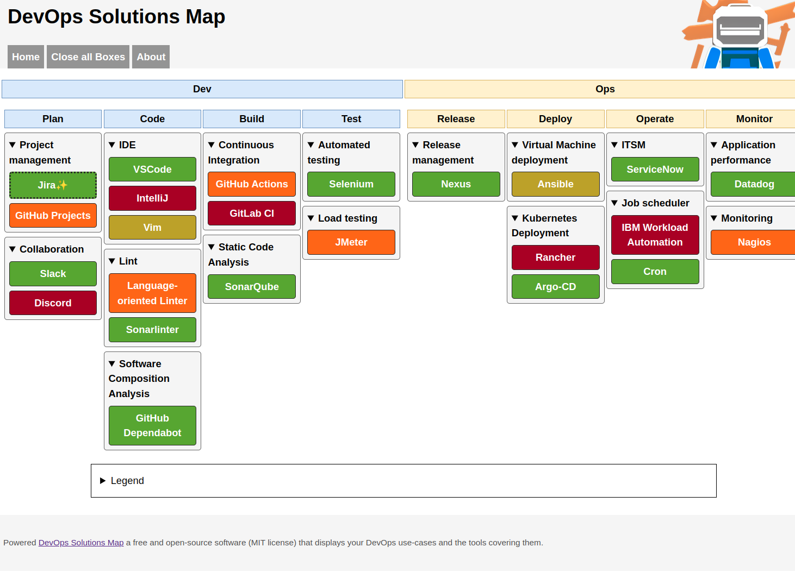

# DevOps Solutions Map

DevOps Solutions Map is a Python-based application that helps you to produce a DevOps tool chain map according to their position in the delivery loop and their use case.

This tool has been inspired by the various tech radar approach.



## Usage

The application is available as a container image you may host and run. The data are formatted using a YAML file that will be rendered by the web application. The content is rendered using the file items order.

### Basic container with volume run

Basic run example, where `version` is the latest [available version](https://github.com/users/Wivik/packages/container/package/devops-solutions-map) :

```bash
podman run -v ./data:/data:Z ghcr.io/wivik/devops-solutions-map:(version)

```

Note : you may also use Docker instean of Pdoman, of course.

### With built-in assets

You can use your company brand logo instead of the project's by replacing the `static/img/logo.png` file in the image's content. Also the `solutions.yaml` file can be integrated in this way too.

Basic Containerfile example :

```Dockerfile
FROM ghcr.io/wivik/devops-solutions-maps:(version)

COPY mylogo.png /devops-map/static/img/logo.png
COPY solutions.yaml /devops-map/data/solutions.yaml

```


## Data file format

Please refer to the [dedicated documentation](data-format.md).

## Contribute

Fork the project, create a branch, open a Pull Request.

Please ensure you're using the [conventional commits](https://www.conventionalcommits.org/en/v1.0.0/) specification for changelog generation.

## License

This project is licensed under MIT.

The mascot is licensed under CreativeCommons CC-BY-SA 4.0.
